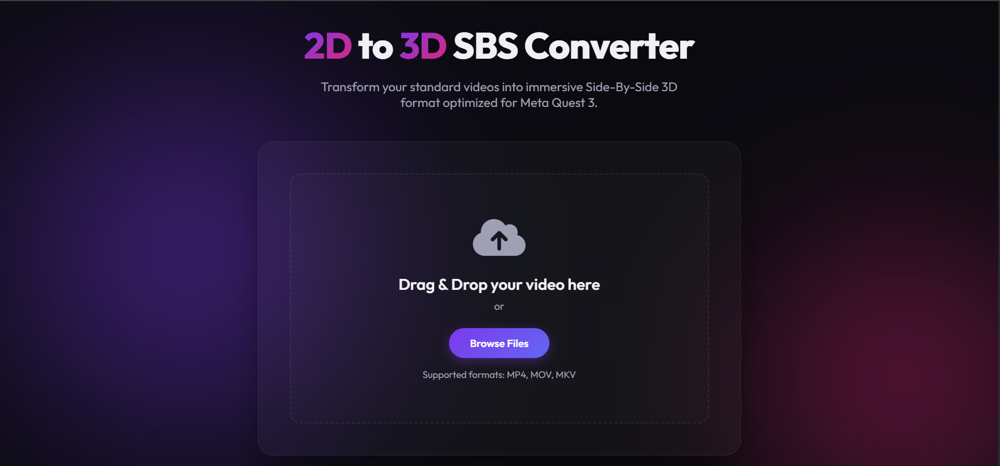
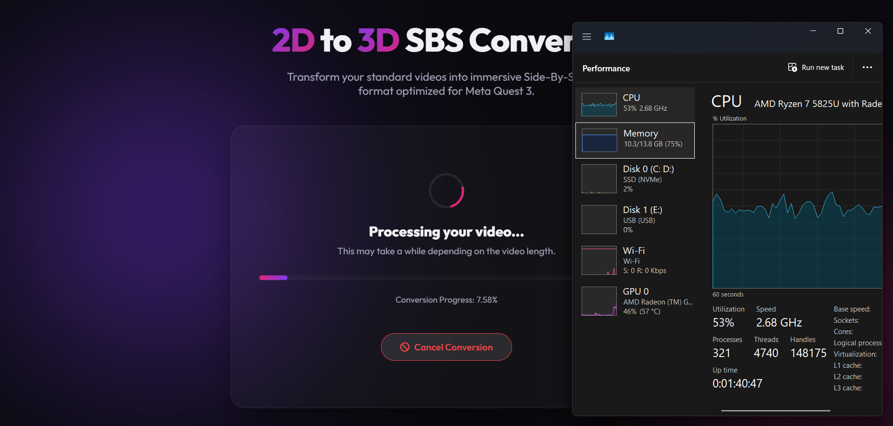
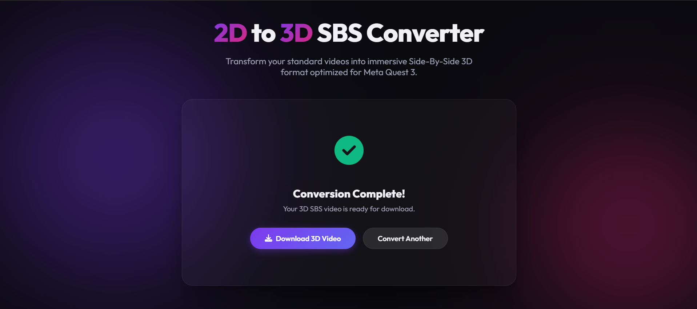
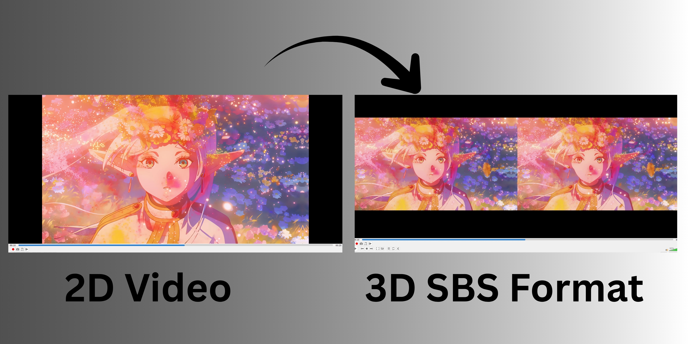

# 2D to 3D Side-by-Side (SBS) Converter

A lightweight, local-first web application that uses AI depth estimation to convert standard 2D flat videos into immersive stereoscopic 3D Side-by-Side (SBS) videos. The resulting videos are perfect for viewing on VR headsets, 3D TVs, or standard devices using cross-eyed/parallel viewing techniques.

## Screenshots
| Upload Interface | Processing & Performance |
| :---: | :---: |
|  |  |
| **Conversion Complete** | **2D to 3D SBS Comparison** |
|  |  |


## Features
- **AI Depth Estimation**: Uses the lightweight `Intel/dpt-swinv2-tiny-256` model to intelligently estimate depth from flat 2D frames.
- **CPU Optimized**: Carefully designed to fall back to CPU processing, making it perfectly viable to run on standard laptops (like AMD Ryzen or Intel Core processors) without needing a heavy dedicated NVIDIA GPU.
- **Hardware-Accelerated Fallbacks**: Uses `h264_amf` (AMD Advanced Media Framework) or equivalent hardware encoders via FFmpeg to speed up rendering where possible.
- **Clean UI**: Simple web interface with drag-and-drop support, real-time conversion progress, and instant download capabilities.
- **Local Privacy**: Runs 100% on your own hardware. Your personal videos are never sent to external cloud servers.

## Minimum Requirements
To run this application locally without crashing, you will need at least the following:
- **CPU**: Modern Multi-core CPU (Intel Core i5 8th Gen / AMD Ryzen 5 or better)
- **GPU**: **Any** (Dedicated GPU *not* required! Integrated graphics are fully supported)
- **RAM**: 8GB Minimum (16GB Recommended for 4K video)
- **Storage**: At least 2GB free space
- **Software**: 
  1. Python 3.8+
  2. FFmpeg (Must be accessible via system PATH)

## Hardware Performance Benchmarks
This app is designed to run efficiently on standard consumer laptops without needing an NVIDIA RTX graphics card. 

Below are real-world conversion times tested on a **Lenovo IdeaPad Slim 3** (Specs: **AMD Ryzen 7 5825U, 2GB Integrated AMD Radeon Graphics, 16GB RAM**):

| Video Resolution | Video Length | Processing Time |
|------------------|--------------|-----------------|
| **1080P (FHD)**  | 3 Minutes    | ~15 Minutes     |
| **1440P (2K)**   | 3 Minutes    | ~35 Minutes     |
| **2160P (4K)**   | 3 Minutes    | ~70 Minutes     |

## Installation

1. Clone the repository:
   ```bash
   git clone https://github.com/vijayakumardevforge/2D-to-3D-SBS-Converter-Lite.git
   cd 2D-to-3D-SBS-Converter-Lite
   ```

2. Set up the Python environment (optional but recommended):
   ```bash
   python -m venv venv
   # On Windows:
   venv\Scripts\activate
   # On macOS/Linux:
   source venv/bin/activate
   ```

3. Install the required Python packages:
   ```bash
   cd backend
   pip install -r requirements.txt
   ```

## Usage

### 1. Start the Backend
The AI conversion engine runs as a Flask server.
```bash
cd backend
python app.py
```
*The backend will start on `http://127.0.0.1:5000`.*

### 2. Start the Frontend
In a new terminal window, serve the frontend HTML files.
```bash
cd frontend
python -m http.server 8000
```
*Alternatively, you can just open `frontend/index.html` directly in your web browser, or use VS Code Live Server.*

### 3. Convert Videos
- Navigate to `http://127.0.0.1:8000` in your web browser.
- Upload any standard 2D video file (MP4, MKV, WebM, etc.).
- Wait for the conversion to complete and download your new 3D SBS video!

## How it Works
1. The backend receives a video and begins reading it frame-by-frame using OpenCV.
2. The AI depth model generates a greyscale depth map for every single frame.
3. Pixels in the original frame are mathematically shifted horizontally based on the depth map intensity (closer objects shift more than background objects).
4. The script synthesizes distinct Left-Eye and Right-Eye perspectives.
5. The frames are stitched together horizontally (Side-by-Side) and piped directly into FFmpeg to mux the original audio back into a high-quality H.264 output video.

## License
[MIT License](LICENSE)
